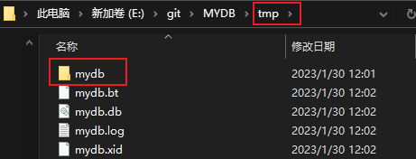
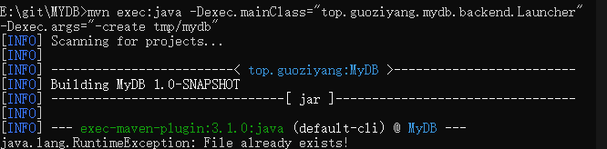
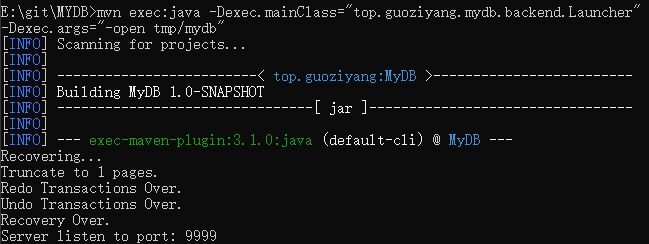
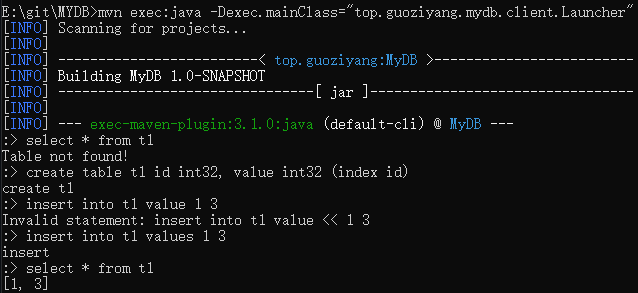
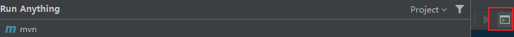
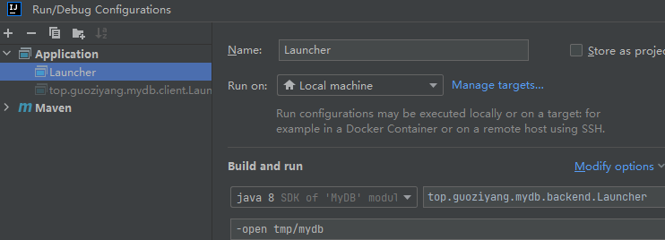
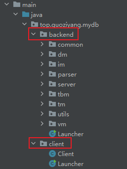

# MYDB

MYDB 是一个 Java 实现的简单的数据库，部分原理参照自 MySQL、PostgreSQL 和 SQLite。实现了以下功能：

- 数据的可靠性和数据恢复
- 两段锁协议（2PL）实现可串行化调度
- MVCC
- 两种事务隔离级别（读提交和可重复读）
- 死锁处理
- 简单的表和字段管理
- 简陋的 SQL 解析（因为懒得写词法分析和自动机，就弄得比较简陋）
- 基于 socket 的 server 和 client

## 运行方式

注意首先需要在 pom.xml 中调整编译版本，如果导入 IDE，请更改项目的编译版本以适应你的 JDK

首先执行以下命令编译源码：

```shell
mvn compile
```

接着执行以下命令以 /tmp/mydb 作为路径创建数据库：

```shell
mvn exec:java -Dexec.mainClass="top.guoziyang.mydb.backend.Launcher" -Dexec.args="-create /tmp/mydb"
```

随后通过以下命令以默认参数启动数据库服务：

```shell
mvn exec:java -Dexec.mainClass="top.guoziyang.mydb.backend.Launcher" -Dexec.args="-open /tmp/mydb"
```

这时数据库服务就已经启动在本机的 9999 端口。重新启动一个终端，执行以下命令启动客户端连接数据库：

```shell
mvn exec:java -Dexec.mainClass="top.guoziyang.mydb.client.Launcher"
```

会启动一个交互式命令行，就可以在这里输入类 SQL 语法，回车会发送语句到服务，并输出执行的结果。

一个执行示例：


## 编译补充

 [CN-GuoZiyang/MYDB: 一个简单的数据库实现 (github.com)](https://github.com/CN-GuoZiyang/MYDB) 

下载源码后，可以通过两种方式运行该项目

1. 切到 ```pom.xml``` 所在文件目录下，调出 cmd，然后按照上述流程执行
2. 在 idea 中执行

下面分别说明下上述两种方式的详细流程和注意事项

### 0. 通用配置

① 先修改 pom.xml 文件中的 jdk 的版本

```xml
<properties>
    <project.build.sourceEncoding>UTF-8</project.build.sourceEncoding>
    <maven.compiler.source>8</maven.compiler.source>
    <maven.compiler.target>8</maven.compiler.target>
</properties>
```

 [pom.xml中的maven.compiler.source和maven.compiler.target作用 - 逆火狂飙 - 博客园 (cnblogs.com)](https://www.cnblogs.com/heyang78/p/15999421.html) 

② 创建文件 tmp/mydb 作为数据库路径 



即：作者提到的 /tmp/mydb 文件需要手动创建

不过这里有个小问题，图片上的文件目录创建在 MYDB 目录下也即执行 maven 命令的目录下，后面指令中的 ```/tmp/mydb``` 均需要修改为 ```tmp/mydb```


### 1. 命令行编译

在 ```pom.xml``` 所在的目录下，打开 cmd ，按顺序执行即可



需要注意的是，若下次重新打开数据库连接，使用原数据库，可直接执行

```shell
mvn exec:java -Dexec.mainClass="top.guoziyang.mydb.backend.Launcher" -Dexec.args="-open tmp/mydb"
```



启动本机的 9999 端口后，在另一个 cmd 界面中执行启动客户端的命令



### 2. IDEA 编译

① 点击右侧的小框输入 mvn 指令



② 后面的指令通过使用配置文件的方式，设置启动参数



第一次执行时，将 open 改为 create，后续直接执行 open 即可

 [如何在IDEA内设置启动参数和环境变量_idea 配置环境参数_Space Tripper的博客-CSDN博客](https://blog.csdn.net/qq_45793102/article/details/122302705#:~:text=如何在IDEA内设置启动参数和环境变量 1 1. 点击Edit,Configuration 2 2、设置页面 3 3、配置信息) 

不继续采用①的方式，可能因为 idea 中编译问题，提示找不到文件

③ 依次启动两个 Launcher 文件



